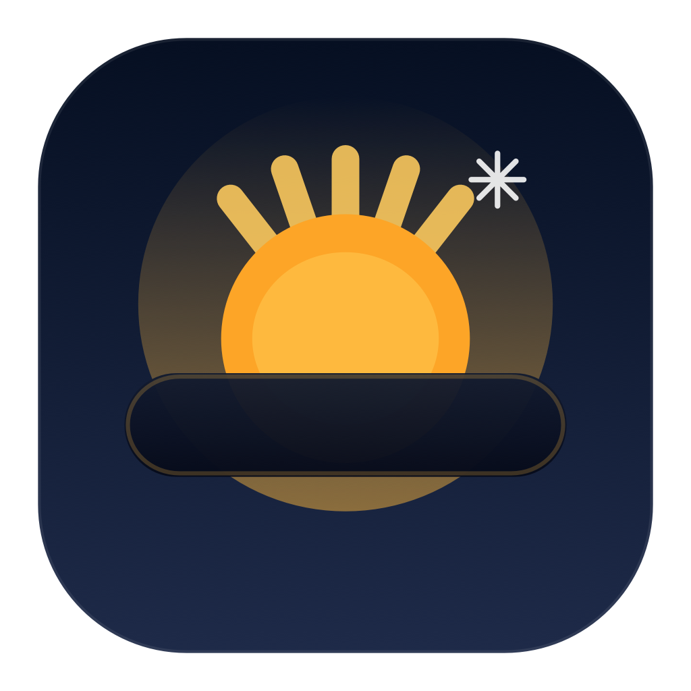

# Wake

[](https://github.com/javascripto/wake-macos/actions/workflows/release.yml)

Wake é um pequeno app para macOS que mantém o Mac acordado enquanto está ativado.

Ele usa as assertions nativas de gerenciamento de energia do macOS, funciona como um utilitário de barra de menu e inclui um ícone personalizado no bundle `.app`.



Versão em inglês: [README.md](./README.md)

## Como funciona

Em vez de chamar `caffeinate`, o app usa as power assertions nativas do macOS via `IOKit`:

- `PreventUserIdleSystemSleep`
- `PreventUserIdleDisplaySleep`

Quando o Wake está ativo, o ícone da barra de menu muda para o estado habilitado. Quando é desativado, ele libera as assertions e o Mac volta ao comportamento normal de suspensão.

O bundle do app também inclui um ícone customizado `Wake.icns`, enquanto o status item na barra de menu continua usando SF Symbols em template mode.

## Desenvolvimento local

Build do executável:

```bash
swift build
```

Build do bundle `.app`:

```bash
./scripts/build_app.sh
```

Esse script:

- compila o executável em release
- gera `dist/Wake.app`
- cria `Wake.icns` apenas quando ele não existe ou quando `scripts/generate_app_icon.swift` foi alterado
- copia o ícone para `Wake.app/Contents/Resources`
- aplica assinatura ad-hoc quando `codesign` está disponível

Criar o `.dmg`:

```bash
./scripts/create_dmg.sh
```

Ou usar os atalhos do `make`:

```bash
make build
make run
make dmg
make release
```

## Fluxo de release

O workflow do GitHub Actions compila o app no macOS e:

- cria `Wake.app`
- cria `Wake.dmg`
- cria `Wake.app.zip`
- envia os artefatos de build
- publica um GitHub Release quando você envia uma tag como `v1.0.0`

## Observações

- O app roda como um utilitário de barra de menu e não mostra ícone no Dock.
- O ícone do bundle é gerado a partir de `scripts/generate_app_icon.swift`.
- O status item na barra de menu continua usando SF Symbols em template mode, então ele fica monocromático na barra.
- O app gerado é assinado ad-hoc localmente para facilitar distribuição e empacotamento.
- Se quiser forçar uma nova geração do ícone, apague `.build/app-icon/Wake.icns` e rode `./scripts/build_app.sh` novamente.
- Se o macOS bloquear o app baixado, rode uma vez após instalar: `xattr -dr com.apple.quarantine /Applications/Wake.app`.
